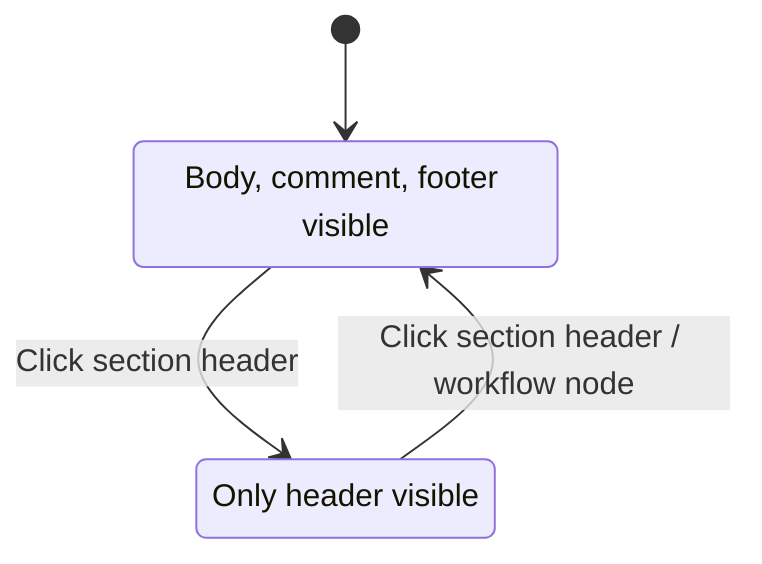
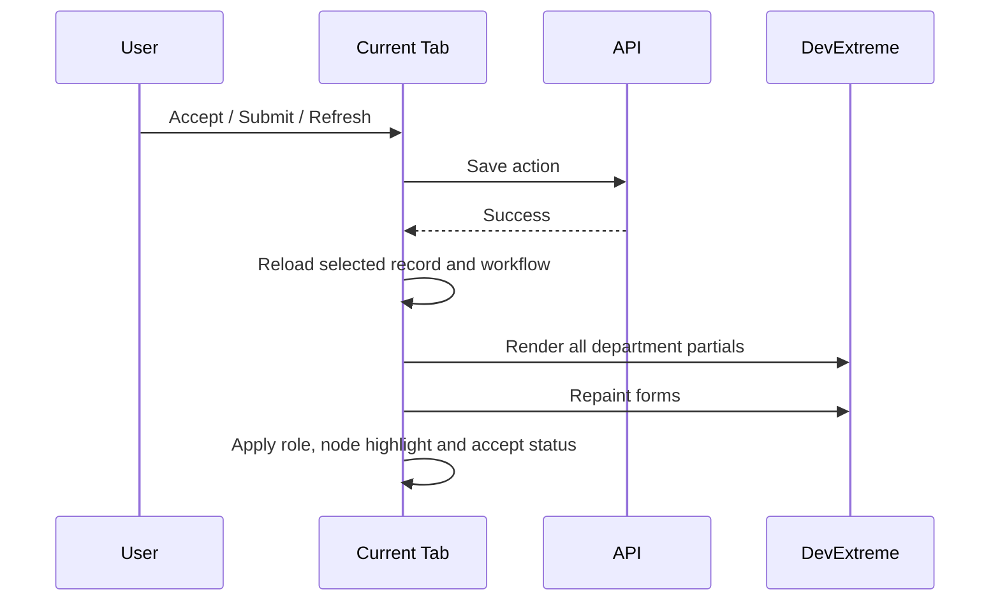

# Quotation & Policy Issuance Forms

## 1. Mục tiêu

Hai form Quotation và Policy Issuance hiển thị hồ sơ theo từng department section. Người dùng chỉ được sửa section phù hợp với role hiện tại, đồng thời vẫn có thể xem lịch sử, attachment và trạng thái xử lý của các section khác.

## 2. Bố cục màn hình

```text
┌────────────────────────────────────────────────────────────────────┐
│ Record information     Role selector      Workflow / Comment tools │
├───────────────┬────────────────────────────────────────────────────┤
│ Workflow tree │ FO section                                         │
│               │  Header / Assignee / Updated time                  │
│ FO            │  Upper body                                        │
│ TS            │  Main form                                         │
│ UW            │  Comments / Attachments / Decision                 │
│ LMKT          ├────────────────────────────────────────────────────┤
│ PM            │ TS / UW / LMKT / PM sections                       │
└───────────────┴────────────────────────────────────────────────────┘
```

Policy Issuance sử dụng FO, TS và PM. Quotation sử dụng FO, TS, UW, LMKT và PM.

## 3. Role switching và edit permission

1. Người dùng chọn role từ role selector.
2. Hệ thống cập nhật `currentUserRole` và biến `_role`.
3. Section trùng role được chuyển sang editable.
4. Section khác role được read-only.
5. Save button và attachment uploader được cập nhật đồng thời.
6. Super User có thể được phép thao tác trên tất cả section.

### Business rules

- Role switching không được làm mất dữ liệu đã render.
- Upload/Delete attachment phải đồng bộ với quyền edit của form.
- Policy Issuance và Quotation phải áp dụng cùng nguyên tắc permission.
- Department truyền vào decision phải lấy từ section hiện tại, không dùng biến bị ghi đè bởi PM hoặc role khác.

## 4. Section collapse/expand

Khi click header hoặc nút mũi tên:

- `upperbody`, `body`, `lowerbody` và `footer` được collapse cùng nhau.
- `min-height` và `max-height` được đưa về `0` khi collapse.
- Comment và attachment không được để lại khoảng trống.
- Khi expand, chiều cao được phục hồi và nội dung tiếp tục hiển thị đầy đủ.



## 5. Decision và Accept status

### UI rule

- Accept status nằm phía trên toàn bộ decision buttons.
- Accept dùng màu success.
- Reject/Decline dùng màu danger.
- Section đã accept dùng màu accepted chung từ `window.DecisionColors`.
- Policy Issuance và Quotation dùng chung style.

### Trạng thái

| Điều kiện | Hiển thị | Button behavior |
|---|---|---|
| Chưa accept | Không có accept status | Accept khả dụng theo role |
| Đã accept | `Accepted at: <time>` | Các button liên quan bị disable theo flow |
| Stored action status | Hiển thị action đã lưu | Không tạo trùng button |
| Reject/Decline | Hiển thị quyết định tương ứng | Thực thi route/decision được cấu hình |

### Màu global

Các màu decision được khai báo tại `_LayoutReference.cshtml`:

```javascript
window.DecisionColors = {
  accepted: "#17a2b8",
  accept: "#28a745",
  reject: "#dc3545",
  warning: "#ffc107",
  normal: "#6c757d",
  textOnColor: "#ffffff"
};
```

## 6. Reload và render partial

### Yêu cầu

Sau Accept, Submit hoặc refresh, hệ thống phải render lại đầy đủ tất cả partial trong tab hiện tại. Người dùng không cần đóng tab và mở lại.

### Luồng



Reload requests được coalesce để tránh render trùng khi SignalR và action callback chạy gần nhau.

## 7. Remarks editor

- Quotation dùng `QuotationIdManager.remarkBox()`.
- Policy Issuance dùng `PolicyIssuanceIdManager.remarkBox()`.
- Sau reload, HTML editor phải được khởi tạo lại.
- Nếu không tìm thấy element, hệ thống ghi warning ra console để hỗ trợ chẩn đoán.

## 8. Workflow node screen condition

`WorkflowInstanceNode.Data` có thể chứa:

```json
{
  "screenConditions": [
    {
      "sectionId": "resAttachment",
      "mode": "Show",
      "condition": ""
    }
  ]
}
```

Quy tắc:

- Section được điều khiển bởi workflow mặc định bị ẩn.
- Khi workflow reach node có `mode = Show`, section được hiển thị.
- Ví dụ `resAttachment` chỉ hiển thị tại node được cấu hình.

