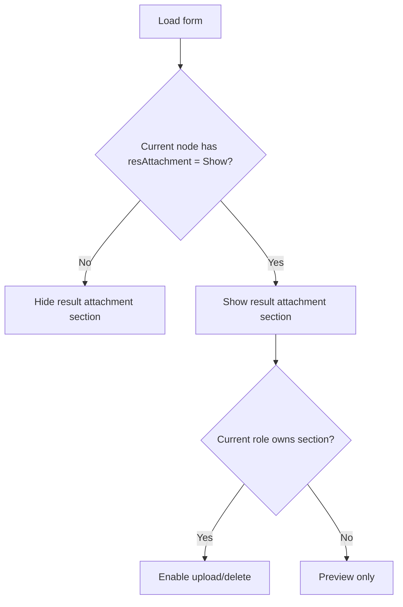

# Attachment — User Guide & Functional Rules

## 1. Phạm vi

Attachment được dùng trong Quotation và Policy Issuance, gồm upload, delete, preview, copy và hiển thị theo workflow condition.

## 2. Permission matrix

| Trạng thái người dùng | Upload | Delete | Preview | Copy |
|---|---:|---:|---:|---:|
| Role trùng section | Có | Có | Có | Có |
| Role khác section | Không | Không | Có | Có |
| Super User | Có | Có | Có | Có |
| Section bị workflow ẩn | Không hiển thị | Không hiển thị | Không hiển thị | Không hiển thị |

Khi switch role, uploader và delete action phải cập nhật ngay, không cần reload tab.

## 3. Upload flow

1. Mở section đúng role.
2. Chọn hoặc kéo file vào uploader.
3. Hệ thống upload file và refresh attachment list.
4. File mới xuất hiện với action phù hợp quyền hiện tại.

Policy Issuance phải dùng cùng logic enable/disable như Quotation.

## 4. Preview classification

| File type | Preview behavior |
|---|---|
| Image | Hiển thị ảnh, giới hạn trong viewport |
| Word/Excel/PowerPoint | Gọi Office preview tương ứng |
| PDF | Hiển thị PDF viewer |
| Text | Hiển thị nội dung text trong vùng đọc |
| Không hỗ trợ | Thông báo không thể preview |

Preview không hiển thị link download. Các thao tác download/copy nằm ở action riêng.

## 5. Copy attachment

Action Copy thực hiện:

1. Ưu tiên ghi file vào clipboard bằng `ClipboardItem` nếu browser hỗ trợ.
2. Nếu browser không cho phép copy binary, fallback sang copy link file.
3. Người dùng chuyển sang web email/editor và Paste.

### Giới hạn trình duyệt

- Clipboard API phụ thuộc HTTPS, browser permission và MIME type.
- Không thể đảm bảo mọi webmail nhận binary file như native Outlook.
- Khi binary clipboard không được hỗ trợ, link là fallback an toàn.

## 6. Kéo thả sang ứng dụng khác

Kéo file từ browser sang Outlook hoặc ứng dụng desktop phụ thuộc browser và hệ điều hành. Hệ thống hỗ trợ drag/drop trong phạm vi browser/editor nhưng không cam kết drag-out binary file cho mọi ứng dụng ngoài browser.

## 7. Workflow-controlled attachment section

## 8. Acceptance criteria

- Không upload được khi role không phù hợp.
- Switch sang đúng role sẽ enable uploader mà không reload.
- Quotation và Policy Issuance có behavior giống nhau.
- Preview ảnh/Office/PDF/text đúng loại.
- Preview không làm vỡ layout.
- Section điều khiển bởi workflow mặc định ẩn và chỉ hiện tại node phù hợp.

