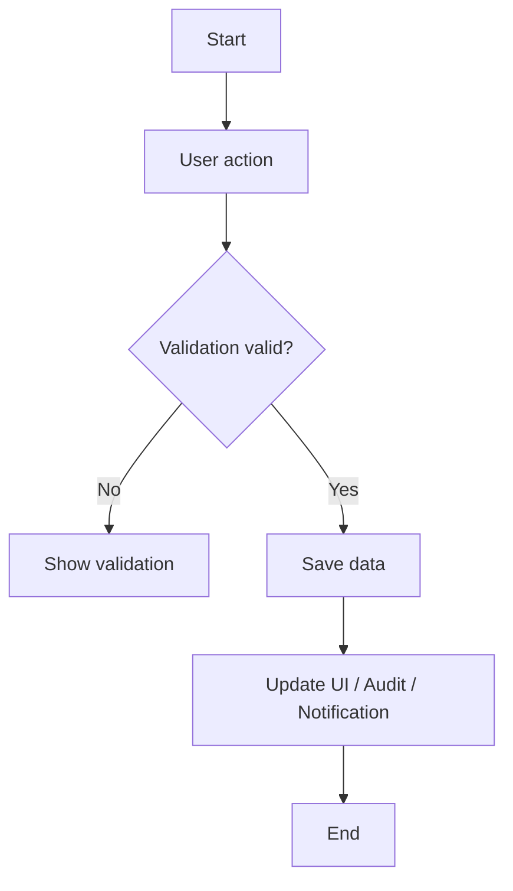

# Functional Specification Document — Template

> Project: Workflow Management  
> Module: `<Quotation / Policy Issuance / Attachment / Notification / SLA>`  
> Version: `<x.y>`  
> Author: `<name>`  
> Reviewers: `<Business / IT / QA>`  
> Status: `<Draft / In Review / Approved>`

## 1. Document control

### 1.1 Revision history

| Version | Date | Author | Description |
|---|---|---|---|
| 0.1 | YYYY-MM-DD |  | Initial draft |

### 1.2 Approval

| Role | Name | Decision | Date |
|---|---|---|---|
| Business Owner |  |  |  |
| Product Owner |  |  |  |
| IT Owner |  |  |  |
| QA Lead |  |  |  |

## 2. Objective and scope

### 2.1 Business objective

`Mô tả vấn đề nghiệp vụ và kết quả mong muốn.`

### 2.2 In scope

- `<Function 1>`
- `<Function 2>`

### 2.3 Out of scope

- `<Excluded function>`

### 2.4 Assumptions and dependencies

| ID | Assumption/Dependency | Owner |
|---|---|---|
| DEP-01 |  |  |

## 3. Actors and permissions

| Actor | View | Create/Update | Approve | Admin configuration |
|---|---:|---:|---:|---:|
| FO | ✓ | ✓ |  |  |
| TS | ✓ | ✓ |  |  |
| UW | ✓ | ✓ | ✓ |  |
| LMKT | ✓ | ✓ | ✓ |  |
| PM | ✓ | ✓ | ✓ |  |
| IT Admin | ✓ |  |  | ✓ |

## 4. Current and target process

### 4.1 Target process



## 5. Functional requirements

| Requirement ID | Function | Description | Priority | Source |
|---|---|---|---|---|
| FR-001 |  |  | Must | Business |
| FR-002 |  |  | Should | Business |

### FR-001 — `<Requirement title>`

**Preconditions**

- `<Condition>`

**Trigger**

- `<User/System event>`

**Main flow**

1. User ...
2. System ...
3. System ...

**Alternative/exception flow**

1. If ...
2. System ...

**Postconditions**

- `<Result>`

**Business rules**

- BR-001: `<Rule>`

## 6. Screen specification

### 6.1 Screen inventory

| Screen ID | Screen name | Actor | Purpose |
|---|---|---|---|
| SCR-001 |  |  |  |

### 6.2 Wireframe

```text
┌────────────────────────────────────────────────────────────┐
│ Screen title                               [Primary action] │
├────────────────────────────────────────────────────────────┤
│ Filter / status / helper text                              │
├────────────────────────────────────────────────────────────┤
│ Main content                                               │
│                                                            │
├────────────────────────────────────────────────────────────┤
│ Validation / secondary actions                             │
└────────────────────────────────────────────────────────────┘
```

### 6.3 Field specification

| Field ID | Label | Control | Required | Editable by | Validation | Data field |
|---|---|---|---:|---|---|---|
| FLD-001 |  |  |  |  |  |  |

### 6.4 Action specification

| Action ID | Label | Visible when | Enabled when | Result |
|---|---|---|---|---|
| ACT-001 | Save |  |  |  |

## 7. Data and integration

### 7.1 Data mapping

| Business field | Entity | Property | Type | Notes |
|---|---|---|---|---|
|  |  |  |  |  |

### 7.2 API mapping

| API ID | Method | Endpoint | Purpose | Success | Error handling |
|---|---|---|---|---|---|
| API-001 | GET |  |  | 200 |  |
| API-002 | PUT/POST |  |  | 200 |  |

### 7.3 Audit and notification

| Event | Audit content | Notification type | Receiver |
|---|---|---|---|
|  |  |  |  |

## 8. Validation and error handling

| Rule ID | Condition | Message | UI behavior |
|---|---|---|---|
| VAL-001 | Required value missing |  | Focus invalid field |

## 9. Non-functional UI requirements

- Responsive at supported desktop/tablet resolutions.
- Rich HTML must not overflow its container.
- Status must include text, not color only.
- Keyboard access for interactive cards/buttons.
- Reload must not create duplicate controls or lose editor state.

## 10. Acceptance criteria

| AC ID | Given | When | Then | Requirement |
|---|---|---|---|---|
| AC-001 |  |  |  | FR-001 |

## 11. UAT scenarios

| Test ID | Scenario | Test data | Expected result | Actual result | Status |
|---|---|---|---|---|---|
| UAT-001 |  |  |  |  | Not Run |

## 12. Requirement traceability

| Requirement | Screen/Action | API/Data | Acceptance criteria | UAT test |
|---|---|---|---|---|
| FR-001 | SCR-001 / ACT-001 | API-001 | AC-001 | UAT-001 |

## 13. Open issues

| Issue ID | Description | Owner | Target date | Status |
|---|---|---|---|---|
| OI-001 |  |  |  | Open |

