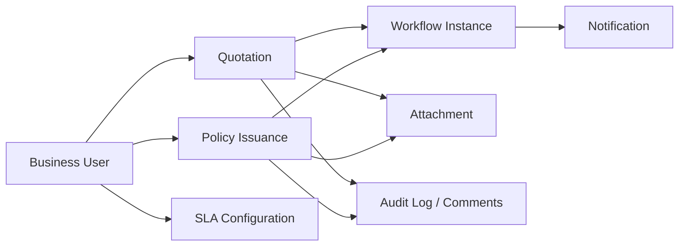

# Workflow Management — FSD Working Documents

Tài liệu này tổng hợp các chức năng đã được cập nhật cho Workflow Management. Mục tiêu là cung cấp nội dung đầu vào để hoàn thiện Functional Specification Document (FSD), hướng dẫn người dùng và kịch bản UAT.

## Danh mục tài liệu

| Tài liệu | Nội dung |
|---|---|
| [01-workflow-forms.md](01-workflow-forms.md) | Quotation, Policy Issuance, role, section, decision, accept status và reload |
| [02-attachments.md](02-attachments.md) | Upload, permission, preview, copy và điều kiện hiển thị attachment |
| [03-notification-audit-log.md](03-notification-audit-log.md) | Notification type, filter, HTML message viewer và Audit Log |
| [04-sla-user-guide.md](04-sla-user-guide.md) | Giao diện và cách cấu hình SLA dành cho business user |
| [05-ui-layout.md](05-ui-layout.md) | Layout, logo, section collapse, DataGrid và responsive UI |
| [06-uat-checklist.md](06-uat-checklist.md) | Checklist kiểm thử và acceptance criteria |
| [07-fsd-template.md](07-fsd-template.md) | Template FSD có sẵn section, requirement ID và traceability |

## Phạm vi hệ thống

## Vai trò chính

| Role | Phạm vi điển hình |
|---|---|
| FO | Khởi tạo và cập nhật thông tin đầu vào |
| TS | Xử lý nghiệp vụ kỹ thuật |
| UW | Thẩm định và đưa ra quyết định underwriting |
| LMKT | Phê duyệt hoặc từ chối theo luồng marketing |
| PM | Quản lý/phê duyệt ở bước cuối hoặc bước được phân công |
| Super User | Có thể thao tác vượt giới hạn role thông thường theo cấu hình hệ thống |
| IT Admin | Thiết kế enum, workflow và cấu hình kỹ thuật |

## Quy ước sử dụng trong FSD

- **Current role**: role đang được chọn trên màn hình.
- **Stage department**: department đang giữ workflow step hiện tại.
- **Focus department**: section người dùng đang xem hoặc được highlight.
- **Accept status**: trạng thái thể hiện section đã được accept cùng thời điểm accept.
- **Module key**: `qt` cho Quotation, `pi` cho Policy Issuance.
- **RecordGuid**: khóa dùng chung để truy vấn comment/audit theo hồ sơ.

## Gợi ý cấu trúc FSD chính thức

1. Business objective.
2. Actor và permission matrix.
3. Functional flow.
4. Screen specification.
5. Validation và business rules.
6. Data/API mapping.
7. Exception handling.
8. Audit và notification.
9. Acceptance criteria.
10. UAT evidence.
